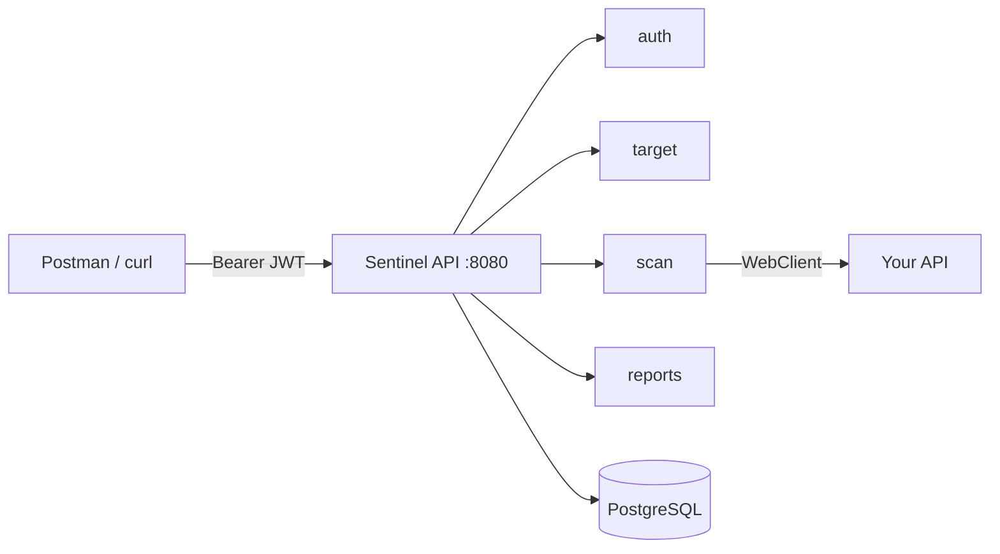

# Sentinel Security Lab


Backend study project — I built this to practice API security concepts while learning Spring Boot 3.

Registers a local API as a target, runs a set of HTTP checks against it, and returns findings with severity levels and a risk score. Everything is read-only and capped with timeouts. Not a real attack tool — the idea is to catch common misconfigurations in your own APIs while developing.

---

## Checks

- **Security headers** — HSTS, CSP, X-Frame-Options, X-Content-Type-Options, Referrer-Policy, Permissions-Policy, Server version disclosure
- **CORS** — wildcard origin, reflected arbitrary origin, null origin acceptance
- **Swagger / Actuator** — public docs endpoints and Spring Boot Actuator exposure (`/actuator/env`, `/actuator/mappings`, etc.)
- **JWT** — `alg=none` acceptance, expired token accepted, endpoints accessible without auth
- **Rate limiting** — no HTTP 429 after repeated requests, missing rate-limit headers
- **HTTP response analysis** — stack traces in error bodies, DB error messages, internal filesystem paths
- **Unauthenticated endpoints** — common paths that respond 200 without a token (`/api/admin`, `/h2-console`, `/graphql`, etc.)

## Stack

Java 21 · Spring Boot 3.2 · Spring Security · JWT (JJWT 0.12) · WebClient (Reactor/Netty) · PostgreSQL 16 + Flyway · Docker Compose · Prometheus + Grafana · OpenAPI 3

## Architecture



Scan jobs are async — `POST /api/scans` returns 202 immediately, the scanners run in a bounded thread pool (2 core / 5 max), and you poll for status.

## Running locally

```bash
git clone https://github.com/ghsantos-software/Sentinel-Security-Lab.git
cd Sentinel-Security-Lab

# start postgres and redis
docker compose up postgres redis -d

mvn spring-boot:run
```

App at `http://localhost:8080` · Swagger UI at `/swagger-ui.html`

For the full stack (app + Prometheus + Grafana):

```bash
docker compose up --build
```

Grafana at `:3000` (admin/admin), Prometheus at `:9090`.

## Main endpoints

```
POST /api/auth/register
POST /api/auth/login

POST /api/targets                   register a target (local/private IPs only)
GET  /api/targets

POST /api/scans                     start scan — pick which types to run
POST /api/scans/full/{targetId}     run all 7 check types at once
GET  /api/scans/{id}                job status (PENDING → RUNNING → COMPLETED)
GET  /api/scans/{id}/dashboard      findings grouped by severity + risk score
GET  /api/scans/{id}/findings       full findings list, sorted by severity

POST /api/reports/generate/{jobId}
GET  /api/reports/{id}

POST /api/scans/analyze-token       decode a JWT without needing the secret
GET  /api/scans/types               list available scan types
```

## What's next

- Cookie security flags (Secure, HttpOnly, SameSite)
- HTTP method enumeration
- Open redirect detection
- Export report as PDF
- Simple HTML frontend — tired of opening Postman every time

---

Only accepts local and private network URLs as targets (`localhost`, `127.x`, `10.x`, `192.168.x`, `172.16-31.x`). Public IPs are rejected at registration.
